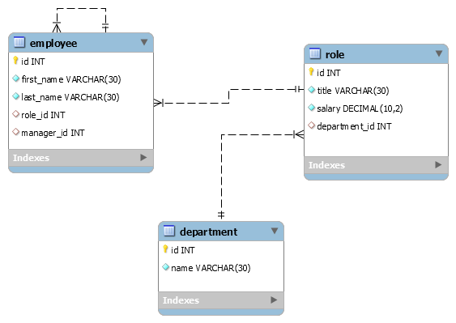
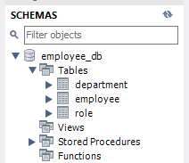
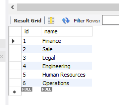
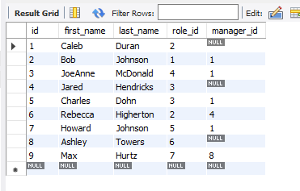
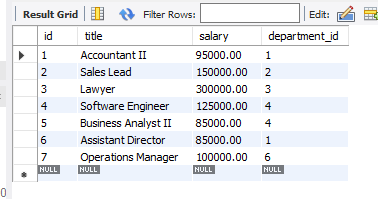

# Homework Assignment 12 - Employee Tracker


## Description

The main goal for this assignment is to build command line interface application that can serve as a content management system (CMS) that an employer can use to keep track of employee information. The CMS must be built using node, inquirer, and MySQL.

## Table of Contents

Please use the table of contents provided below to navigate through the ReadMe.

- [Links for Required Submission Items](#links-for-required-submission-items)
- [Assignment Scope](#assignment-scope)
- [Installation](#installation)
- [Database Structure](#database-structure)

## Links for Required Submission Items

Links to submission items will be provided once the assignment is complete.

- Link to GitHub repo - [Repo for Employee Tracker App](https://github.com/KEDuran/Employee_Tracker)
- Link to demo recording - [Demo Recording for Employee Tracker App](https://drive.google.com/file/d/1gSf12LetxqePv8bzVFGV7ntLeab2MXNR/view?usp=sharing)

## Assignment Scope

### User Story

Here is the user story for this assignment that was provided by the Trilogy team.

```
As a business owner
I want to be able to view and manage the departments, roles, and employees in my company
So that I can organize and plan my business
```

### Acceptance Criteria

Here is a list of the acceptance criteria required for this assignment that was provided by the Trilogy Team. Please note that bonus criteria items were **_not_** coded into this assignment.

#### MVP

The command line application must allow the user to:

- Add departments, roles, employees

- View departments, roles, employees

- Update employee roles

## Installation

#### Make Sure to Install / Run

- **Node.js** - Make sure `Node.js` is installed in your machine. If `Node.js` is not installed on your machine, [click here](https://nodejs.org/en/) to download the application.
- **NPM Install** - The `package.json` file included in this repo already lists all Node modules, NPM packages, and other dependencies that are required to successfully run this application.
  - Please make sure to run the `NPM install` in the root directory to access the following three NPM packages: (a) [MySQL](https://www.npmjs.com/package/mysql), (b) [InquirerJs](https://www.npmjs.com/package/inquirer/v/0.2.3), and (c) [console.table](https://www.npmjs.com/package/console.table).

## Database Structure

This section will be updated once the application is developed.

### Database Schema

The image below was generated using the MySQL Workbench application. The image below provides a visual representation of the table relations for the three tables include in the employee-db database.



### Database Table Output

The images below provide visual representation of how the data structured in the `employee_db` database that was created for this assignment.

#### Database Structure via MySQL Workbench Navigator

The image below confirmd that the `employee_db` is composed of the following three tables: (a) deparment table, (b) employee table, and (c) role table.



#### Output per Database Table

The images below provide a visual representation of how the data is stored within each of three tables (i.e. department, employee, and role table).

##### Department Table



##### Employee Table



##### Role Table


